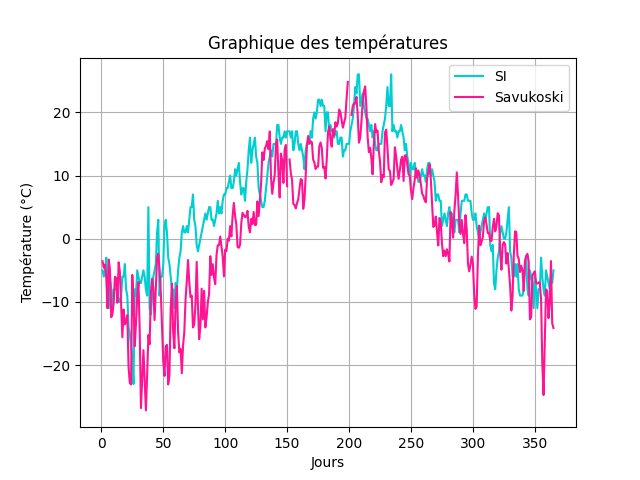

# Correction du TP1 :

## Fichier SI

Graphique pour les températures à l'année :

-----------------

## Explications de notre méthode pour corriger les valeurs du jeu SI-erreur

Dans la fonction __read_climat_file()__ du fichier mainSI-erreur.py, nous avons décidé de corriger les valeurs de la façon suivante : 

- Lire notre fichier en créant un `dataframe`.

- Parcourir notre fichier.

- Identifier si la valeur est bien de type `String`.

- Faire la moyenne de la valeur supérieur et inférieur de la valeur sur laquelle nous allons nous arrêter car c'est un type `String`.

- Remplacer cette dite valeur par la moyenne précédemment calculée.

- Ajouter valeur à un tableau.

- Dans ce tableau nous allons avoir toutes les données de notre fichier.
  
<!-- - Nous allons donc parcourir ce tableau et calculer la moyenne et l'écart-type de chaque mois.
- Pour déterminer si celle-ci est supérieure à la moyenne et l'écart-typa additionnées.
- Nous affectons à cette valeur, la moyenne précédemment calculée. -->

Nous avons décidé de mettre une moyenne à la place des valeurs erronées pour avoir des graphiques cohérents.

-----------------

## Comparaison des données corrigées et des valeurs sans erreur du fichier

Nous avons constaté que les données corrigées sont proches des valeurs sans erreurs, par exemple pour les mois de mars et juin :

 Mois | MARS | JUIN
------------ | ------------- | -------------
Valeur sans erreur | 1.1935483870967742 | 17.033333333333335
Valeur corrigée | 1.2419354838709677 | 17.0

-----------------
## Analyse des données opendata du second fichier

Nous avons fait la moyenne de chaque mois en ayant fait au préalable la moyenne des colonnes (Air temperature, Maximum temperature, Minimum temperature). Ensuite, nous avons pu facilement comparer les moyennes de chaque mois des deux fichiers et constater que les températures du second fichier sont des températures plus froid en hiver notamment les mois de Janvier, Février et Mars que le premier et un peu moins chaud l'été.

Nous avons pu constater que le climat du premier fichier est un __climat d'une ville situé au Nord de l'Europe__. Probablement un climat __continental__ car en hiver nous constatons qu'il fait très froid (environ -8° en février) et qu'il fait très doux ou agréablement chaud en été (environ 18° en juillet).

Après avoir comparé les données sur le site infoclimat grâce aux différents graphiques, nous en avons déduit qu'il s'agissait peut être d'Oslo, Reykjavik, Stockholm ou d'Helsinki.

Nous avons ensuite extrait le fichier de données sur le site kaggle (https://www.kaggle.com/sudalairajkumar/daily-temperature-of-major-cities) pour les analyser et les comparer à notre premier fichier. Nous avons convertir les températures Fahrenheit en degré Celsius.

Chaque graphiques représentent les températures par jours pour l'année __2018__  de notre fichier SI et d'une autre ville.

###### Comparaison du SI avec Savukoski

###### Comparaison du SI avec Olso

###### Comparaison du SI avec Helsinki

###### Comparaison du SI avec Reykjavik

###### Comparaison du SI avec Stockholm

###### Comparaison du SI avec toutes les villes

-----------------

## La capitale européenne

Nous en avons déduit qu'il s'aggisait de la ville d'__Helsinki__.

-----------------

