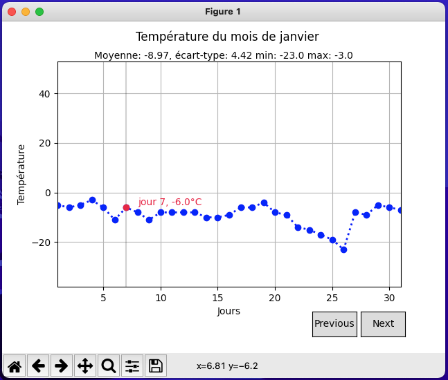
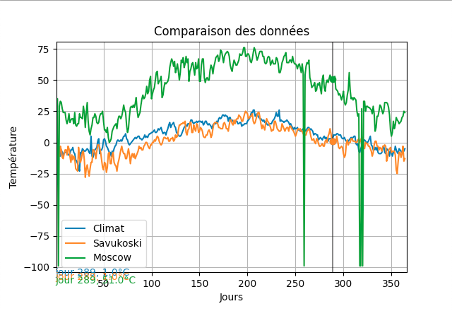

# TP2 - Qualité de données - Réadapté

## Install

Installation des dépendances :

```sh
pip install -r requirements.txt
```

PS: il est conseillé d'utiliser un environnement virtuel (`virtualenv` ou `venv`)

## Usage

Exécution du programme avec les données valides

```sh
python3 main.py
```

Exécution du programme avec les données non conformes

```sh
python3 App/app.py
```

Exécution du programme afin de comparer les graphiques

```sh
python3 compare_data.py --csv Data/Climat.csv,Data/Savukoski.csv,Data/Moscow.csv
```

## Question du TP

Les premières questions, celles sur le calcul de statistiques et affichage des données via des courbes et un cursor mobile sont inclus dans les fichiers `main.py` et `graph.py` situés à la racine.

Exemple de courbe : 



### Recommencez	avec le	jeu	SI-erreur après	avoir corrigé les valeurs en erreur. Précisez vos méthodes.

Pour corriger le fichier des données `SI-erreur`, nous avons en premier déterminé les données erronées telles que

- Les valeurs vide (NaN)
- Les valeurs incohérentes (valeur hexadécimale comme température)

Pour le traitement nous avons trouvé deux solutions

- Oublier les valeurs
- Deviner à partir d'autres variables

Nous avons choisi comme solution de deviner les variables manquantes ou erronées en faisant la moyenne des valeurs existantes pour chaque mois 

### Les	données	corrigées sont elles proches des valeurs sans erreur ?

Les résultats obtenus sont sensiblement identique. Il y a des écarts (max août à 48° par exemple) mais qui ne viennent pas des erreurs corrigées.

### A partir de données opendata du second	fichier, retrouver le type de climat

D'après le fichier donné en complément provenant de `Savukosi kirkonkyla`, station `Finlandaise`, il y règne un climat froid, voir tempéré mais avec de grands écarts observable entre les période estivale et hivernale.

### Reprendre les données typiques de la localisation proche fournies en complément,	comparer les écarts.

#### Méthode

L'objectif est d'extraire les données d'une ville européenne, effectuer le traitement comme pour les données que l'ont possède et y opérer un ratio sur chacune des données pour vérifier la corrélation. 

* De 0 à 0,5, les données ne sont pas corrélé,
* De 0,5 à 0,8, les données commencent à se ressembler
* de 0,8 à 0,9, les données sont cohérente et corrélé, 
* de 0,9 à 1 les données sont identiques (ou presque).

Il serait aussi envisageable d'effectuer la différence entre les valeurs lue à chaque `X`, ou même effectuer la différence des aires entre les deux courbes superposées, afin d'éviter une estimation de corrélation `validé` alors que visuellement, les courbes se croisent et sont en miroir, ce qui en ferait des courbes absolument pas identique.

### Qu'en concluez vous	?

Nous en concluons que les données de `Savukosi kirkonkyla` ne correspondent pas aux données que nous possèdons, il y a trop de différence visible sur la superposition des courbes ainsi que sur les coefficients.

### De quelle capitale européenne avez vous	eu les données ?

L'objectif est d'extraire les données d'une ville européenne, effectuer le traitement comme pour les données que l'ont possède et y opérer un ratio sur chacune des données pour vérifier la corrélation. 

Afin d'estimer d'où proviennent les données, nous avons utilisé deux sites :

* https://nomadlist.com/climat-finder
* Recherches filtrées : https://bit.ly/3apRmoL 
* https://www.kaggle.com/sudalairajkumar/daily-temperature-of-major-cities 

Nous avons d'abord comparer visuellement les moyennes de températures avec des villes de régions du monde cohérente avec celles que nous possèdons. Via le site nomadlist nous avons pu trouver une ville qui correspond plus ou moins à nos données, en se basant sur une recherche à partir des valeur maximale et minimale sur un mois car à l'année, les écartes étaient trop grand et ne permettait pas un filtre optimisé. 

Le second site nous a permis d'obtenir les données sous format csv et donc permettre la comparaison expliciter plus haut.

Actuellement nous pensons qu'il s'agit d'une de ces villes parmis :

* Moscou


* Yekaterinburg


* Izhevsk


NB: Ces données sont certainement basé sur l'année `2020`, il se peut donc que le climat entre `2018` et `2020` ait pu changer dans ces villes, faussant par la même occasion nos observations.

Cependant, seule `Moscou` est présent dans le fichier en provenance de `Kaggle`.

Nous avons donc créer un nouveau fichier csv à partir du csv de kaggle pour n'avoir que Moscou sur l'année `2018` (le fichier en provenance de `Savukosi kirkonkyla` affiche des données dantant de `2018`).

Lors de la création du fichier, nous avons remarqué des données incohérente voir abérrante. Il semblerait que le fichier `kaggle` nous affiches des données en `Fahrenheit`, nous avons donc du créer une fonction pour les convertir en celsius.

### Qu'en concluez vous	?

D'après le graphique généré, il semblerait que les températures de `Moscou` de `2018` ne correspondent absoluement pas à nos données.

Il faudrait donc réitérer le processus avec d'autres données.


